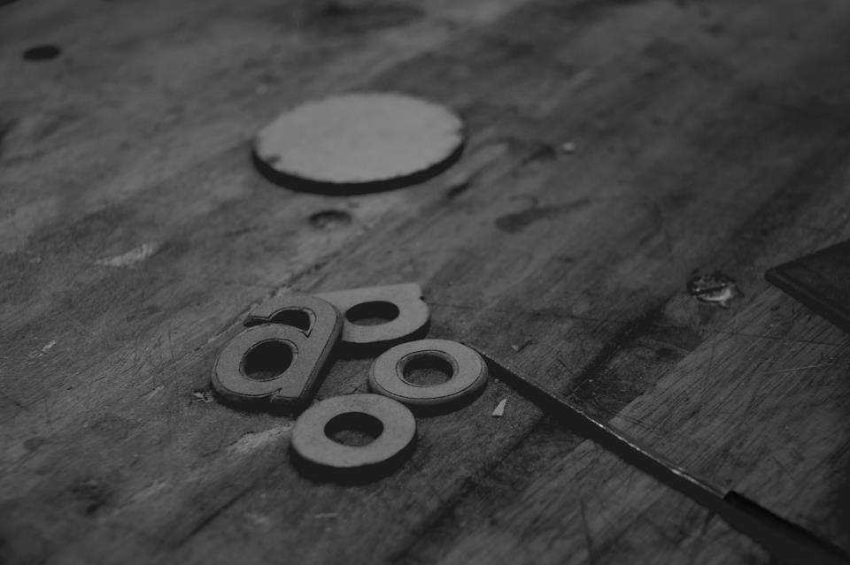
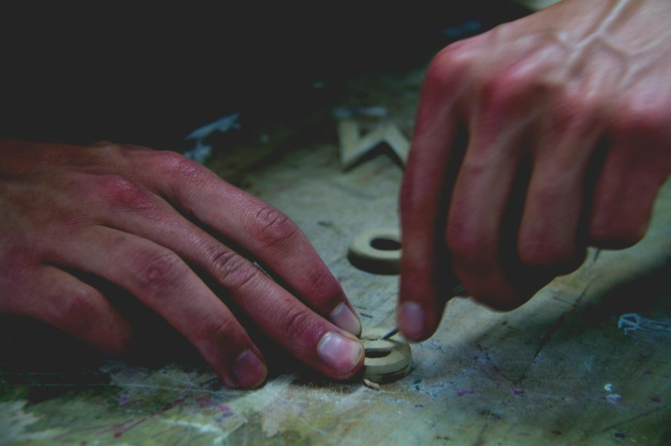
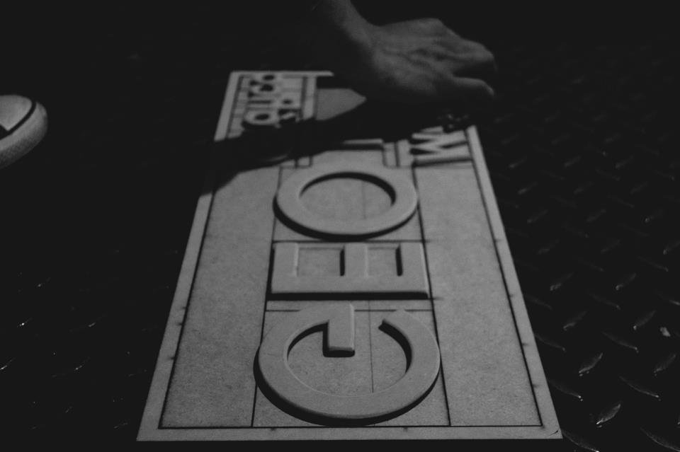
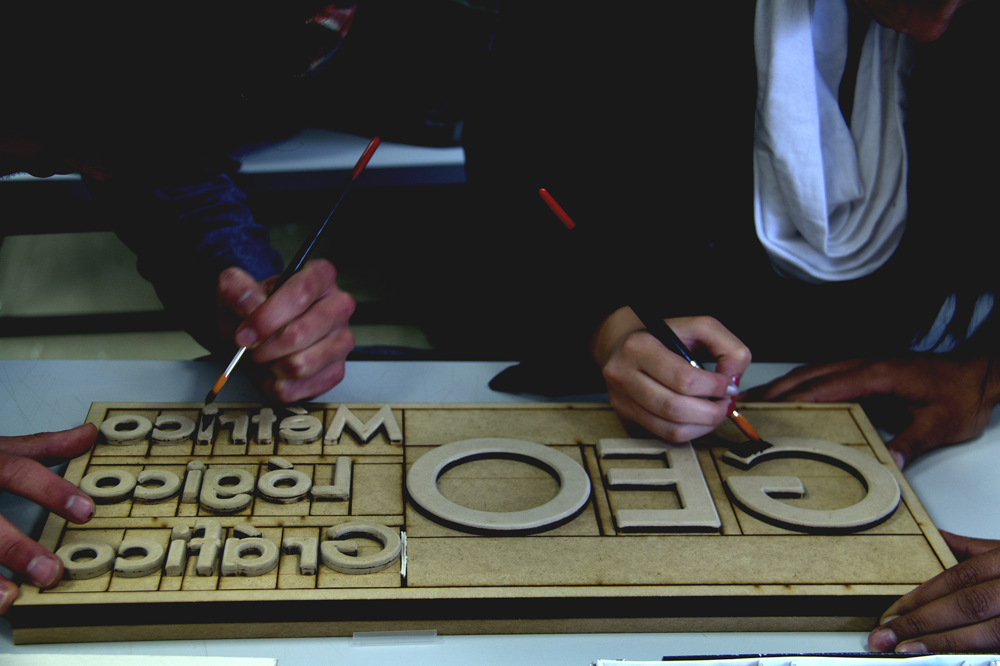

+++
title = "Tipos Móviles"
date = 2013-01-29T02:13:50Z
author = "Sergio L. Benítez D., Carlos Celis, Leonardo Hidalgo, Ricardo Ladino y Catalina Saavedra"
description = "Creación de una galera para el entendimiento de los conceptos técnicos relativos a los tipos móviles"
+++

Los tipos móviles son unas piezas actualmente metálicas utilizadas para ejercer la impresión a presión. Sus orígenes se atribuyen a la cultura oriental en el año 1040 d. C., en donde el chino Bi Sheng genero un sistema de tipos móviles en porcelana. Uno de los principales abandonos de la cultura oriental sobre el tema de los tipos móviles se atribuye al enorme conjunto de caracteres que suelen manejar los alfabetos de estos países. Esta iniciativa fue retomada por el alemán Johannes Gutenberg, cuyo aporte más significativo fue establecer un material que hiciera el tipo móvil más resistente.

> Son varias las diferencias entre un _tipo_ y un _carácter_. El tipo es elaborado con un material, posee características volumétricas, se compone de relieves y se construye sobre un paralelepípedo. Por el contrario, el carácter es plano, su condición es de dos dimensiones y es el símbolo gráfico que resulta del proceso de impresión peso-presión.

* * *

## La Galera

Como actividad lúdica se diseñó una galera con cada una de sus piezas en un material accesible como lo es la madera. Uno de los propósitos de esta labor era vivir en carne propia la impresión peso-presión y así poder emular las experiencias a las cuales Gutenberg entregó su vida. La fuente trabajada es la popular  __Futura__ diseñada por el alemán Paul Renner en 1927.

Una peculiaridad del diseño de los tipos es que en su cara principal el grabado de la letra debe estar invertido. Una vez establecidas las referencias se procede a lijar los bordes de la letra para dar forma a la rebaba, una inclinación que permite un desmolde con reducidas imperfecciones. En el ámbito profesional, el tipo móvil opera el cuerpo y la letra en una sola pieza. Bajo nuestra condición de novatos el cuerpo y la letra se fabricaron en dos piezas distintas.

> La galera: Cajon de madera de forma rectangular donde se guardan los signos tipográficos.

Una véz situadas las piezas dentro de la galera, se pintó con óleo el ojo del tipo móvil para ejecutar la impresión peso-presión sobre el soporte que para este caso fue propalibro.

* * *
