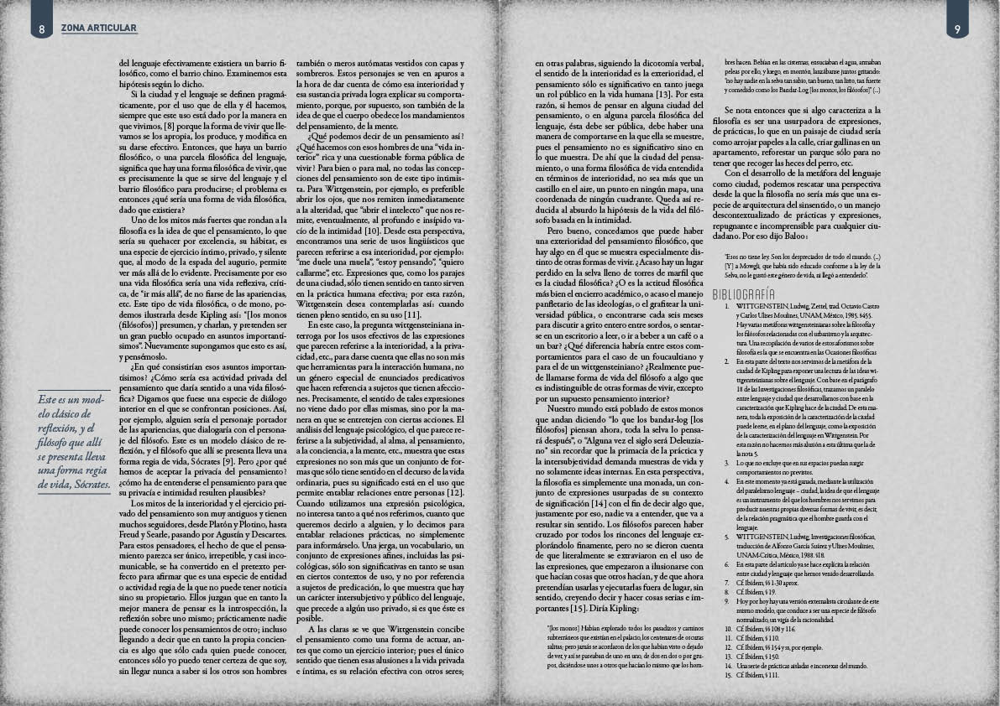

+++
title = "Cuadrante Phi"
date = 2013-09-10T02:13:50Z
author = "Sergio L. Benítez D"
description = "Trabajo de editorial y diagramación para estudiantes de la factultad de filosofía de la Universidad Javeriana "
tags = [
    "design",
    "editorial",
]
+++

La diagramación es un oficio del diseño editorial que se encarga de organizar en un espacio, contenidos escritos, visuales y en algunos casos audiovisuales en medios impresos y electrónicos como revistas, libros, diarios.

> El diseño editorial generalmente incluye varias etapas de un proceso que inicia en el diseño gráfico y culmina en procesos de producción. Los procesos de producción están directamente relacionados con la impresión.

* * *

## CuadrantePhi

CuadrantePhi es una revista digital gestionada por un grupo de estudiantes de la facultad de filosofía de la Universidad Javeriana de Bogotá. La revista reune contenidos de diferentes profesionales y estudiantes de varios países de habla hispana en torno a temas y autores filosóficos.

El objetivo consistió en reconstruir el concepto de publicación digital que se estaba utilizando, ya que se limitaba a hipervínculos y archivos .pdf dentro de una página web. La propuesta consistió en una revista que unificará las rúbricas que se exponían en la página web y que su acceso pueda ser digital o impreso. Para ello se establecieron varios esquemas de diagramación con el fin de distribuir amigablemente los elementos que componen una revista académica

### Fuentes utilizadas

+   __Bebas Neue__ para títulos principales
+   __DINpro__ para la tabla de contenidos, numeración de páginas, indicador de sección e información editorial
+   __Blanch__ para títulos secundarios y subtítulos
+   __Garamond__ para textos y cajas

### Portada

El diseño de la portada consistió en la creación de un monograma con los caracteres "C" y "Phi" de la fuente Bebas Neue. Una vez definido el monograma se realizó una transformación de rotación de 45 grados y para unir el asta descendente del carácter "Phi" se ejecutó una transformación de reflejo horizontal en un duplicado del carácter en cuestión. Por otra parte, se aplicó una trasformación de reflejo vertical en el carácter "C". Con estas alteraciones se conformaron varias repeticiones para construir un patrón con el monograma. El resultado se visualiza en la siguiente imagen.

### Diagramación

La diagramación se elaboró sobre una plantilla de dos columnas que ocupan el 75 % de la página. Dentro de estas columnas se ubicó el texto primordial del artículo. El 25 % restante se utilizó para habilitar el uso de cajas en donde se resaltan frases o contenidos que forman parte de lo comprendido en el texto principal. Todos los artículos inician con letra capital y se utiliza la fuente Garamond en diferentes tamaños para administrar los contenidos citados. En la siguiente imagen se ilustra esta descripción:

Para los interesados en temas filosóficos a continuación les comparto el documento final con la diagramación del primer número de la revista CuadrantePhi. Advierto que los contenidos no son para todo tipo de público y mi objetivo se reduce a exponer la distribución que se estableció para este elemento.

<iframe src="/assets/pdf/cuadrante_phi_no_01.pdf"></iframe>
