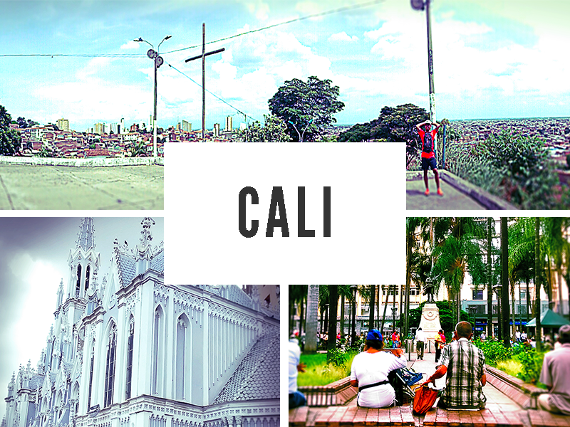
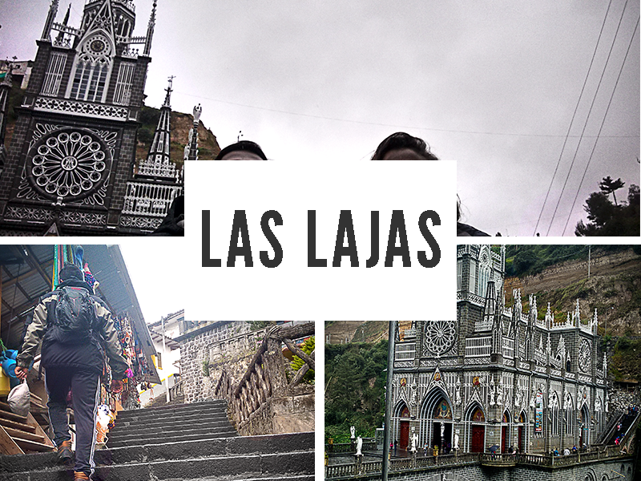

+++
title = "Sudamérica, Colombia"
date = 2016-03-09T02:13:50Z
author = "Sergio L. Benítez D"
description = "Historias sobre mi viaje por Suramérica"
+++

El 17 de Febrero del 2015 inicie la travesía para cumplir un objetivo que me había planteado mientras terminaba mis estudios universitarios. Dicho objetivo era realizar un viaje por sudamérica que expandiera mi visión del mundo en cuanto temas culturales, naturales y personales, respetando la faceta de viajero e ignorando el perfil de turista. Esta experiencia no hubiera sido la misma, sin la compañía de la mujer con quien comparto mis arrebatos, la cual además de su grata compañia ha sido complice de la construcción de un apoyo mutuo para alcanzar nuestras metas. En las siguientes líneas compartiré nuestra preparación para el viaje, algunos gastos, las descripciones sobre los lugares y las personas que enriquecieron este recorrido de casi 7000 Km.

Por la extensión del viaje, he decidido clasificar el desarrollo del texto por país haciendo énfasis en la ruta que finalmente ejecutamos (dicha ruta fue adaptada varias veces). A su vez, compartiré algunas de las fotografías que complementan las descripciones para así hacer más llamativos y agradables los relatos.

## Preparación

El panorama era el siguiente: Había trabajado un año con la intención de agrupar fondos para sustentar los gastos de este viaje. El hecho que nos impulsó para dejar de posponer este objetivo, fue haber comprado los tiquetes Buenos Aires-Bogotá para el 21 de Mayo del 2015. Dicha preparación también tuvo la asesoría de cinco personas que ya habían realizado este recorrido. De antemano agradezco a cada una de ellas por su apoyo y su participación a través de consejos que nos fueron de gran utilidad. La siguiente lista agrupa los elementos con los que iniciamos el viaje:

+ Seguro de viaje
+ Tiquetes BUE-BOG
+ Monopod
+ Mochilas de 50 y 65 litros
+ Carpa y sobrecarpa*
+ Botas de expedición
+ Chaquetas impermeables
+ Bolsas de dormir
+ Libro Sudamérica para mochileros, editorial Lonely Planets. (Recomendado)

>  *Se recomienda comprar una carpa con su sobrecarpa respectiva. Por desconocimiento se compraron ambos productos por serparado, y evidentemente fue un problema que nos hizo pasar un desagradable momento.

## Cali

Luego de 8 horas de viaje con temperaturas heladas por el hábito cuestionable de los choferes de los buses intermunicipales en convertir el bus en una nevera, se arribó a la terminal de transportes terrestres de la ciudad de Cali, la tierra del cholado, referente mundial por bailar el género músical de la salsa y denominada artísticamente como la sucursal del cielo. Unos  familiares habitan en esta ciudad y ellos nos compartieron su casa para recibir nuestra corta visita. Habíamos obtenido indicaciones para llegar a nuestro destino con la ruta "Ermita 2", pero nuestra novicia en viajes mochileros nos caracterizaba por tener equipajes pesados y el medio de transporte que ejecutaba la ruta era un colectivo de 15 puestos que las veces que pasó tenía un sobrecupo de pasajeros. Ambos argumentos nos llevaron a tomar un taxi.

Al llegar a casa de nuestros familiares, los saludos calurosos fueron presentes, pero la fatiga por las horas de viaje era evidente. Cada uno tomó una refrescante ducha, un merecido almuerzo y una inevitable siesta. En horas de la tarde, se fijaron dos destinos; el mirador de Belalcázar y los gatos de Tejada. Con ayuda de Google Maps y Tripadvisor se trazó el trayecto. Nuevamente la Ermita 2 era nuestra mejor alternativa. Se abordó el bus y la desorientación nos ganó la partida. Se anduvo cerca de tres horas en el colectivo hasta llegar al barrio Floralia, ubicado al otro extremo de la ciudad de nuestro temporal hospedaje. La lógica para continuar el camino fue "sigamos que esta ruta debe volver". No se esperaba llegar al lugar en donde la ruta hace cambio de chofer, y por ende se tuvo que pagar un nuevo pasaje. Se regreso a casa con la tarea pendiente del conocer el mirador de Belalcázar y los gatos de Tejada. Sin embargo, se pudo contemplar las diferentes facetas de Santiago de Cali desde la ruta Ermita 2. 

Segundo dia en Cali, el itinerario ya estaba definido. Luego de un alentador desayuno se parte hacia el complejo deportivo de la ciudad, otra vez con la ruta de la Ermita 2. Estas instalaciones evidencian el compromiso de la ciudad con las actividades deportivas como un legado por ser la sede de los juegos panamericanos de 1971. La sorpresa fue ser testigos del gran número de personas ejerciendo algún deporte (béisbol, hockey, tenis fútbol, baloncesto, voleibol, natación entre otros). De manera muy amable nos invitaron a practicar el béisbol, pero rechazamos la oferta porque aún se tenían varios destinos pendientes y este era nuestro último día en Calí.

Próxima parada, el escenario en donde el irrespetuoso equipo de fútbol que he apoyado desde la infancia juega sus partidos de local; el Pascual Guerrero. Además de ser templos del fútbol, mi interés por los estadios se argumenta por las arquitectura ejercida en dichos escenarios y las historias que aguardan. Con una arquitectura moderna y llamativa ejecute la vuelta olímpica intentando recordar el último título del América de Cali en la liga A del fútbol colombiano. El rito le pareció ridículo a mi acompañante, y ejerció presión para continuar nuestro trayecto. 

Se llegó a la plaza de Caicedo en el centro histórico de la ciudad de Cali, no sin antes ser partícipes de un refrescante jugo de naranja y maracuyá. La imponencia de la plaza era expresada por las elevadas palmas que la decoran. Sus senderos tienen la forma de un asterisco y conforman el espacio en donde niños corrían por las praderas, las personas mayores compartían sus relatos desde una banca y los vendedores ambulantes antojaban a sus transeúntes con provocativas pero dañinas comidas rápidas. Luego de un breve descanso, se desciende por un sendero paralelo al río Cali y sin intención alguna nos topamos con la llamativa y tierna arquitectura de la iglesia La Ermita. Hermosa por fuera, sencilla por dentro se presenció unos minutos de misa para dar un reposo a nuestro trayecto. Posteriormente, se siguió el descenso por la paralela del río hasta llegar a la terminal de transportes. Compramos nuestros boletos para nuestro próximo destino y se emprendió el retorno a casa. 

De regreso había una parada antes de ir a nuestro hospedaje; La plaza de los artesanos. Dicho lugar nos recibió con unas empinadas escaleras y al ascender se encontraron instalaciones para ventas que probablemente por la fecha estaban sin mucho movimiento de personas. Seguimos nuestro ascenso e ingresamos a un barrio que se ubicaba sobre la loma, impulsados por alcanzar una llamativa iglesia que divisamos bajo el cielo. Al alcanzar nuestro destino, se tuvo acceso a un hermoso mirador de la ciudad. La extensión de Cali era contemplada por nuestros ojos.

Finalmente se llegó al hospedaje. Se alistaron nuevamente las mochilas intentando mejorar la comodidad, pero los resultados no fueron satisfactorios. Nuestros familiares nos llevaron a la terminal de transporte. Los agradecimientos fueron inevitables por su apoyo en el inicio de esta aventura. Una hogareña despedida y era momento de esperar nuestro viaje de noche hacia Ipiales.

## Santuario de las Lajas

Después de prolongadas horas de viaje se llegó a la terminal de transportes de la fría pero acogedora Ipiales. Los equipajes fueron guardados en la terminal, y se procede a buscar un transporte que nos traslade al imponente santuario de las lajas. Luego de hacer varias cotizaciones, optamos por tomar un taxi, el cual nos dejaría en lo alto de un precipicio. El día estaba lluvioso y había humedad en el ambiente. Se inicia el descenso por unas resbaladizas escaleras y luego de pasar una curva aparece en nuestras vistas un santuario protegido por las montañas. Al comienzo parecía una pieza de juguete porque no se tenía una verdadera noción de su tamaño, pero al estar a un paso de distancia su inmensidad era admirable. Se entró al santuario para contemplar su arquitectura gótica y encomendar nuestra futura aventura. Tentados por la incómoda topografía en donde se ubica la basílica, se decidió descender hasta el riachuelo para poder presenciar una vista inferior de la construcción. 

Se habían recorrido varios senderos para tener varias facetas del santuario, y alejados de nuestro recorrido hacia el santuario se decide empezar el retorno. Se recogen los equipajes en la terminal y buscamos transporte hacia Rumichaca. Un colectivo nos dejaría en la frontera que separa a los países de Colombia y Ecuador. Esta frontera conecta ambos países a través de un puente, el cual se cruzó a pie luego de sellar nuestra salida de Colombia. Al otro extremo del puente se ingresó a otra caseta para sellar nuestro ingreso a Ecuador. En este trayecto nos encontramos a un amigable paísa que al igual que nosotros iniciaba su aventura por toda Sudamérica. Ahora teníamos compañía.
